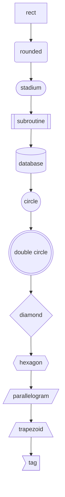

# Mermaid

gridflow speaks two languages. Write **GFD** or **mermaid flowcharts** in the
same editor — the language is detected from the text (a `flowchart`/`graph`
header, or `%%` comments), and both render through the same pipeline. That
means mermaid documents get the full gridflow experience:

- the crisp pan/zoom canvas (text re-rasterizes at every zoom level),
- the layered auto-layout, in all four directions (`TD`, `LR`, `BT`, `RL`),
- every theme (View → Theme), applied live,
- SVG / PNG export matching the canvas,
- double-click a node → jump to its source line, and ⌘J back,
- per-statement error recovery: one bad line never blanks the canvas.

Open `.mmd` / `.mermaid` files directly, or just paste mermaid into an empty
document — the status bar shows which language is active.

## Supported mermaid (flowchart)

| Feature | Notes |
|---|---|
| `flowchart` / `graph` + `TB` `TD` `BT` `LR` `RL` | full direction support |
| all node bracket shapes | mapped to gridflow shapes (table above) |
| quoted labels, ` ` line breaks | `a["text with (specials)"]` |
| edges `-->` `---` `-.->` `-.-` `==>` `===` `<-->` | thick renders **bold**, dotted renders dashed |
| edge labels | `-->|label|`, `-- label -->`, `-. label .->`, `== label ==>` |
| chains and `&` fan-in/out | `a & b --> c & d` |
| `subgraph` … `end` + `direction` | becomes a gridflow group (one level; nesting is flattened with a warning) |
| `classDef` / `class` / `:::` / `style` | `fill:`, `stroke:`, `color:`, `stroke-width:` (≥2.5px → bold), `stroke-dasharray` → dashed |
| `%%` comments, `;` separators | |
| `click`, `linkStyle`, `accTitle`, … | ignored (no effect on geometry) |

Other mermaid diagram types (`sequenceDiagram`, `gantt`, …) are detected and
produce a single clear diagnostic instead of a broken parse.

## What mermaid documents can't do

Mermaid has no placement syntax, so **drag-to-pin is disabled** — dragging a
node springs back and the status bar explains why. Variables, classes, ports,
icons and explicit placement are GFD features.

## Convert Mermaid → GFD

**File → Convert Mermaid → GFD** rewrites the document as equivalent GFD in
one undoable step: nodes with their shapes and styles, edges with labels,
subgraphs as groups, directions preserved. Ids that GFD can't express
(`my-node.1`) are sanitized (`my_node_1`).

Use it when a pasted mermaid diagram is becoming a document you own: after
converting, you can pin nodes by dragging, define classes, use the library —
everything in the rest of this book.

## Detection corner cases

A GFD file that happens to start with a node named `graph` stays GFD —
`graph` only reads as a mermaid header when followed by nothing or a
direction keyword. If detection ever guesses wrong, add a `//` comment as the
first line for GFD, or a `%%` comment for mermaid.
